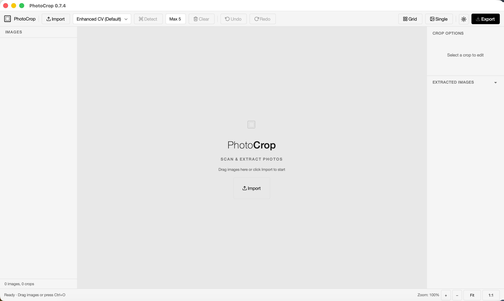

# PhotoCrop


[中文文档](README_CN.md)

Automatically detect and crop individual photos from scanned album pages. A Python desktop app for macOS.

<p align="center">
  
</p>

---

## Why this exists

I was born in the late '90s. Families didn't take many photos back then. Everyone used film cameras. The few childhood photos I have were all shot on film. They can't be reprinted anymore. Most exist only as paper prints in old albums.

Those albums sit in corners around my parents' house. I might open them once a year, during Chinese New Year. Many of the people in those photos are gone.

Twenty years, gone like a dream.

If you're around my age, you're probably working now. Your office has a scanner. Take those old albums, run them through, make a PDF of the past. And those Polaroids - they have no digital version. Just the one paper copy.

I wanted to turn them into digital memories. That's why I built this.

I was PhotoCrop's first user. The reason I made it - the reason I code at all - is to turn those memories into something that can flow through chats, travel across hard drives, live on in data. Not to let old albums slowly rot in a cabinet until everyone in the photos is gone, until the person who owns the album no longer recognizes the faces inside, and throws it away.

PhotoCrop does one thing: crop photos cleanly from scanned pages. No AI enhancement, no restoration. When you look at a blurry old photo and a face comes to mind, no algorithm can reproduce that. The face you remember is more real than any pixel.

You can take the cropped photos and run them through AI restoration if you want. But this tool is just about cropping. If seeing the photo brings someone back to you, that's enough.

The detection pipeline runs locally. Your photos never leave your machine, and nothing gets sent off for training.

---

## Contents

- [Installation](#installation)
- [Quick start](#quick-start)
- [Features](#features)
- [Architecture](#architecture)
- [Requirements](#requirements)

---

## Installation

```bash
git clone https://github.com/Reyes957/PhotoCrop.git
cd PhotoCrop
pip install -e ".[gui]"
```

For YOLO-World (optional, zero-shot detection):

```bash
pip install -e ".[all]"
```

Or use `requirements.txt`:

```bash
pip install -r requirements.txt
```

---

## Quick start

### CLI - single image

```bash
python -m photocrop.main page.jpg --max-count 4
```

### GUI - interactive editor

```bash
python -m photocrop.main --gui
python -m photocrop.main --gui page.jpg
```

### PDF - batch process

```bash
python -m photocrop.main --pdf album.pdf --output ./photos/
```

### Choose a detector

```bash
python -m photocrop.main page.jpg --detector enhanced-cv   # Default
python -m photocrop.main page.jpg --detector cv
python -m photocrop.main page.jpg --detector combined
python -m photocrop.main page.jpg --detector yolo-world
python -m photocrop.main page.jpg --detector model
```

<details>
<summary>GUI keyboard shortcuts</summary>

| Shortcut | Action |
|----------|--------|
| Ctrl+O | Load image/PDF |
| Ctrl+D | Detect photos |
| Ctrl+E | Export all |
| Ctrl+Z | Undo |
| Ctrl+Shift+Z / Ctrl+Y | Redo |
| <- -> | Previous/next page |
| Delete / Backspace | Remove selected crop box |
| Tab / Shift+Tab | Cycle through crop boxes |
| Ctrl+A | Select all crop boxes |
| Ctrl+Click | Add/remove from selection |
| Esc | Deselect all |

</details>

---

<details>
<summary><h2 style="display:inline">Features</h2></summary>

- Multiple detection engines - Enhanced CV (default, better for low-quality scans), Traditional CV (edge detection + morphology), Combined detector (IoU voting fusion), YOLO-World zero-shot detection
- Pluggable detector architecture - ABC base class + factory pattern; write your own
- Three modes - CLI for scripting, GUI for interactive editing, PDF batch for bulk processing
- Controller architecture - 5 controllers (Detection, Export, Session, Theme, View) decouple logic from Qt widgets
- Global state management - AppState observable container with signal subscriptions
- Multi-image management - Left panel with thumbnails, filenames, crop counts; right-click menu
- Crop property panel - Real-time Width/Height/X/Y/Rotation editing with aspect ratio lock
- Crop result preview - 2-column grid with LRU cache; click to select or delete
- PDF multi-page expand - Left panel shows PDF as parent + N child items with thumbnails
- PDF global cross-page preview - All pages' crop boxes in one view, grouped by page, cross-page select/delete
- Crop box rotation - 90 degrees clockwise/counter-clockwise from the floating toolbar
- Single View - Side-by-side: original thumbnail + extracted full-size image with page navigation
- Batch export - JPEG/PNG/TIFF, quality, max dimensions, filename template, auto-rotation, white-border trimming
- Template system - Percentage-based crop templates that work across different images
- Sync & Transform - Sync crop dimensions across selections; flip horizontal/vertical
- Smart export - Auto-rotation correction, white-border trimming, EXIF metadata
- Light/Dark theme - 350ms cubic-bezier color transition animation
- Toast notifications - Non-modal slide-in, max 3 stacked
- Drag & drop import - Drag files onto canvas, supports 8 file formats
- Undo/Redo - Ctrl+Z / Ctrl+Shift+Z / Ctrl+Y
- Multi-select - Ctrl+Click, Ctrl+A, Tab/Shift+Tab, Esc
- Keyboard shortcuts - Ctrl+O load, Ctrl+D detect, Ctrl+E export, arrow keys for pages
- User config - `~/.config/photocrop/config.yaml` for persistent preferences

</details>

---

<details>
<summary><h2 style="display:inline">Architecture</h2></summary>

```
photocrop/
  ├── main.py              CLI / --gui / --pdf entry point
  ├── config.py            User config system
  │
  ├── engine/              Detection pipeline
  │   ├── detector_base.py     ABC for pluggable detectors
  │   ├── cv_detector.py       Traditional CV wrapper
  │   ├── cv_algorithm.py      Core CV algorithm
  │   ├── enhanced_cv_detector.py
  │   ├── combined_detector.py IoU voting fusion
  │   ├── yolo_world_detector.py  YOLO-World (async loading)
  │   ├── model_detector.py    Placeholder for vision API detectors
  │   ├── core.py              Orchestration + factory
  │   ├── filters.py           Small-box filtering, IoU dedup, count limiting
  │   └── rotation_estimator.py  Rotation angle estimation
  │
  ├── ui/                  PySide6 GUI
  │   ├── main_window.py       Toolbar + status bar + shortcuts
  │   ├── canvas.py            Canvas + interactive crop boxes + drag & drop
  │   ├── crop_item.py         Crop region widget (rotation, handles, toolbar, aspect lock)
  │   ├── state.py             AppState global state manager
  │   ├── theme.py             ThemeManager (Light/Dark + transition animation)
  │   ├── toast.py             Toast notifications
  │   ├── press_button.py      Press animation button
  │   ├── undo_manager.py      Undo/redo (full dual-stack)
  │   ├── session.py           Per-image session data class
  │   ├── styled_dropdown.py   Custom dropdown components
  │   ├── image_list_panel.py  Left panel: image list
  │   ├── crop_options_panel.py Right panel: crop properties
  │   ├── extracted_images_panel.py Crop result preview
  │   ├── single_view_panel.py Single View large preview
  │   ├── export_dialog.py     Batch export dialog
  │   ├── template_manager.py  Crop template manager
  │   ├── icons.py             SVG icon loader
  │   ├── utils.py             PIL <-> Qt image conversion
  │   └── controllers/         Business logic layer
  │       ├── detection_controller.py
  │       ├── export_controller.py
  │       ├── session_controller.py
  │       ├── theme_controller.py
  │       └── view_coordinator.py
  │
  ├── export/              Output layer
  │   ├── cropper.py       Crop -> rotate -> trim -> save
  │   └── pdf_reader.py    PDF -> PIL Image
  │
  └── utils/               Shared utilities
      ├── crop_rect.py     CropRect data class
      ├── iou.py           Intersection-over-Union
      └── rotation.py      Angle normalization
```

### Detector abstraction

```python
from photocrop.engine.core import detect_rectangles

# Default: enhanced-cv
rects = detect_rectangles(img)

# Traditional CV
rects = detect_rectangles(img, detector="cv")

# YOLO-World
rects = detect_rectangles(img, detector="yolo-world")

# Your own detector
class MyDetector(BaseDetector):
    def detect(self, page_img):
        ...
rects = detect_rectangles(img, detector=MyDetector())
```

</details>

---

## Requirements

- Python 3.9+
- PySide6 >= 6.5 (GUI)
- PyMuPDF >= 1.23
- OpenCV >= 4.7
- NumPy, SciPy, Pillow
- platformdirs >= 3.0
- (Optional) Ultralytics, PyTorch for YOLO-World

---

## License

MIT
